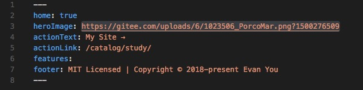
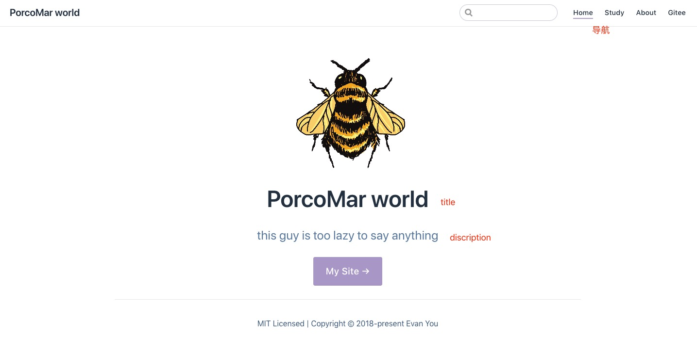

# vuePress说明
---

* vuePress是以vue驱动的主题系统的简约静态网站生成工具（拥有自己的默认主题）。

- veuPress由vue,vue-router,webpack驱动的单页面应用，每个markdonw文件都使用markdonw-it编译为html文件，然后作为vue组件的模板来处理。类似hexo一个极简的静态网站生成器,

Vue与SEO搜索引擎优化
---

* SEO (Search Engine Optimization)-对于开发者来说是一项必不可少的技能，尤其是前端的同学们。比如在html文件头部加上网站的关键字keywords，以及网站描述description，再到正确的使用html标签等，这些在传统的服务端渲染页面的模式下，就妥妥的足够了。    但是随着前端技术的不断发展壮大，前后端分离开发模式的大行其道，越来越多的前端开始使用Vue等MVVM模型的框架进行开发，这种数据驱动，动态渲染的方式，对于搜索引擎爬虫来说是非常不友好的，往往网站的内容很难被正确收录，所以在pc端页面大部分仍然采用服务端渲染的方式

Vue与SSR服务端渲染
---

* Vue结合SSR服务端渲染就是对seo进行优化的一种解决方案，它的原理就是利用webpack和node.js将Vue生成的html文件发送给服务器，然后再由服务器渲染出来。这样做就能渲染正确的html文件，达到搜索引擎的优化，但是缺点也有一些，他要求前端开发者必须了解一些node语法，同时也加重了服务器渲染的压力，开销较大。

VuePress组成
---

+ VuePress由两部分组成：一个基于Vue的轻量级静态网站生成器，以及为编写技术文档而优化的默认主题。 它是为了满足Vue自己的子项目文档的需求而创建的。
VuePress为每一个由它生成的页面提供预加载的html，不仅加载速度极佳，同时对seo非常友好。一旦页面被加载之后，Vue就全面接管所有的静态内容，使其变成一个完全的SPA应用，其他的页面也会在用户使用导航进入的时候来按需加载。

VuePress是怎样运作的
---

- 一个VuePress应用实际上就是基于Vue、VueRouter以及webpack,如果你以前就用过vue,那么当你在用VuePress开发或者定制自己的主题的时候，你会发现使用体验几乎是一毛一样~你甚至可以用Vue DevTools来debug你的定制主题！
在build的过程中，VuePress会通过创建一个服务端渲染的版本，并访问每一个路由来渲染相关的html。这种方法是来自Nuxt的nuxt generate命令,和其他项目如Gatsby的启发。
每个markdown文件都被编译为HTML，然后作为Vue组件的模板进行处理。这样你可以在markdown文件中直接使用Vue，这在需要嵌入动态内容的时候非常有用。

VuePress特性
---

1. 内置的markdown扩展专为技术文档优化
2. 可以在markdown文件中直接使用vue
3. vue驱动的可定制画主题
4. 支持PWA - Progressive Web App（渐进式网页应用程序）
5. 集成Google Analytics
#### 一个默认的VuePress包括：

* 响应式布局
* 可选的主页
* 一个简单的头部搜索组件
* 可定制的导航栏和侧边栏
* 自动生成的GitHub链接和页面编辑链接

开始使用VuePress
---

#### 全局使用
---
        # install globally
        npm install -g vuepress

#### create a markdown file
echo "# Hello VuePress!" > README.md

#### start writing
        vuepress dev .

##### build
        vuepress build .
#### 在现有项目中安装
---

如果你已经有一个项目，可以将VuePress作为本地依赖进行安装，这种方式同样支持使用CI或Netlify等服务在推送时自动部署。

        # install as a local dependency
npm install -D vuepress

        # create a docs directory
        mkdir docs
        # create a markdown file
        echo "# Hello VuePress!" > docs/README.md

#### start writing
        npx vuepress dev docs
也可以直接在package.json中加入：

        {
          "scripts": {
            "dev": "vuepress dev .",
            "build": "vuepress build ."
          }
        }
然后执行下面的命令行来运行项目

        npm run dev
        
默认情况下，构建的文件将位于.vuepress / dist中，也可以通过.vuepress / config.js中的dest字段进行配置。构建的文件可以部署到任何静态文件服务器。

主页(Homepage)
---

默认主题提供了一个主页布局（用于该网站的主页）。要使用它，需要在你的根目录 README.md 的 YAML front matter 中指定 home：true 加上一些其他元数据。这是本网站使用的实际数据：
* README.md : 

简单的 CSS 覆盖
---

如果你希望对默认主题的样式应用简单覆盖，则可以创建一个 .vuepress/override.styl 文件。 这是 Stylus 文件，但你也可以使用普通的 CSS 语法。

有几个颜色变量可以调整：

        // 显示默认值
        $accentColor = #B8A8CF
        $textColor = #2c3e50
        $borderColor = #eaecef
        $codeBgColor = #282c34

具体配置
---

最重要的config.js配置
在此值得注意的是，主题配置不只是简单的样式配置等，其中包括导航与侧边栏部分的配置，此处配置参见官网导航栏”默认主题配置“
在.vuepress目录下生成config.js

        module.exports = {
          // 设置icon
           head: [
            ['link', { rel: 'shortcut icon', type: "image/x-icon", href: `https://gitee.com/uploads/6/1023506_PorcoMar.png?1500276509" rel="shortcut icon` }]
          ],
          //网站标题
          title: 'PorcoMar world',
          // 主页描述
          description: 'this guy is too lazy to say anything',
          // 要部署的仓库名字
          base: '/',
          dest: './.vuepress/dist',
          // 主题配置
          themeConfig: {
            // 导航配置
            nav: [
              // text为导航栏显示文字，link为路径，即文件夹名字，注意不要丢了名字前后的'/'
              {text: 'Home', link: '/'},
              {text: 'Study', link: '/catalog/study/'},
              {text: 'About', link: '/catalog/about/'},
              {text: 'Gitee', link: 'https://gitee.com/PorcoMar/events'}
            ],
            // 侧边栏配置,侧边栏组，不同（导航）页面对应不同的侧边栏
            // 以对象形式配置，前边的key为nav处的路径,后边提供一个数组作为此侧边栏中的子标题
            sidebar: 
            {
              '/catalog/study/': genSidebarConfig('前端开发规范'),
              '/catalog/about/': aboutMe('关于我'),
            },
            // 这是嵌套标题链接，自动显示当前激活（导航）页面标题的链接，即显示深度（h1-h6的深度）
            sidebarDepth: 2
          }
        }
        function genSidebarConfig(title) {
          return [{
            title,
            collapsable: true,
            children: [
              '',
              '/catalog/study/VueJS组件编码规范',
              '/catalog/study/webpack入门',
              '/catalog/study/Markdown写法'
            ]
          }]
        }
        function aboutMe(title){
          return [{
            title,
            collapsable: true,
            children: [
              '',
            ]
          }]
        } 

效果如下：
---

