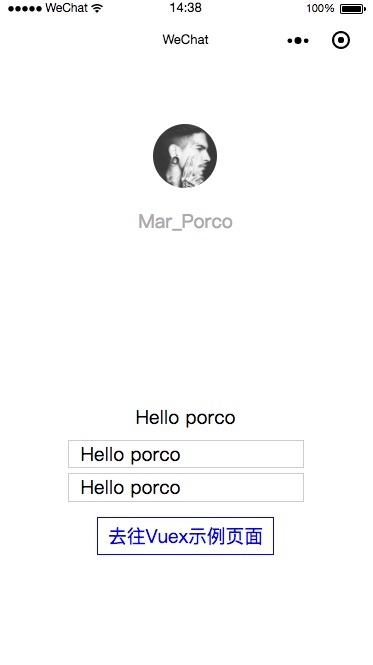

➣ 介绍：
---
::: tip Vue.js in mini program 
mpvue （github 地址请参见）是一个使用 Vue.js 开发小程序的前端框架。框架基于 Vue.js 核心，mpvue 修改了 Vue.js 的 runtime 和 compiler 实现，使其可以运行在小程序环境中，从而为小程序开发引入了整套 Vue.js 开发体验。值得一提的是[mpvue的说明文档](http://mpvue.com/mpvue/#_2)也是用的vuepress
:::

<h3>主要特性</h3>

使用 mpvue 开发小程序，你将在小程序技术体系的基础上获取到这样一些能力：

* 彻底的组件化开发能力：提高代码复用性
* 完整的 Vue.js 开发体验
* 方便的 Vuex 数据管理方案：方便构建复杂应用
* 快捷的 webpack 构建机制：自定义构建策略、开发阶段 hotReload
* 支持使用 npm 外部依赖
* 使用 Vue.js 命令行工具 vue-cli 快速初始化项目
* H5 代码转换编译成小程序目标代码的能力

<h3>配套设施</h3>

mpvue 作为小程序版本的 Vue.js，在框架 SDK 之外，完整的技术体系还包括如下设施。

* mpvue-loader 提供 webpack 版本的加载器
* mpvue-webpack-target webpack 构建目标
* postcss-mpvue-wxss 样式代码转换预处理工具
* px2rpx-loader 样式转化插件
* 其它

### 安装

mpvue 保留了 vue.runtime 核心方法，无缝继承了 Vue.js 的基础能力,mpvue-template-compiler还提供了将 vue 的模板语法转换到小程序的 wxml 语法的能力，修改了 vue 的建构配置，使之构建出符合小程序项目结构的代码格式： json/wxml/wxss/js 文件

通过 Vue.js 命令行工具 vue-cli，你只需在终端窗口输入几条简单命令，即可快速创建和启动一个带热重载、保存时静态检查、内置代码构建功能的小程序项目：
``` js{4}
# 全局安装 vue-cli
$ npm install --global vue-cli
```
* 创建一个基于 mpvue-quickstart 模板的新项目
``` js{4}
$ vue init mpvue/mpvue-quickstart my-project
```
* 安装依赖
``` js{4}
$ cd my-project
$ npm install
```
* 启动构建
``` js{4}
$ npm run dev
```
接下来，你需要启动微信开发者工具，打开dist文件即可创建第一个小程序，如图所示：


➣ 注意点
---

* 不要在选项属性或回调上使用箭头函数，比如 created: () => console.log(this.a) 或 vm.$watch('a', newValue => this.myMethod())。因为箭头函数是和父级上下文绑定在一起的，this 不会是如你做预期的 Vue 实例，且 this.a 或 this.myMethod 也会是未定义的。

- - -
* 微信小程序的页面的 query 参数是通过 onLoad(options) 获取的，mpvue 对此进行了优化，直接通过 this.$root.$mp.query 获取相应的参数数据，其调用需要在 onLoad 生命周期触发之后使用，比如 onShow 等。
- - -
* 不支持 纯-HTML
小程序里所有的 BOM／DOM 都不能用，也就是说 v-html 指令不能用。
- - -
* 不支持部分复杂的 JavaScript 渲染表达式
我们会把 template 中的 {{}} 双花括号的部分，直接编码到 wxml 文件中，由于微信小程序的能力限制(数据绑定)，所以无法支持复杂的 JavaScript 表达式。

目前可以使用的有<code> + - * % ?: ! == === > < [] .，</code>剩下的还待完善。
``` js{4}
<!-- 这种就不支持，建议写 computed -->
<p>{{ message.split('').reverse().join('') }}</p>
```
<!-- 但写在 @event 里面的表达式是都支持的，因为这部分的计算放在了 vdom 里面 -->
``` js{4}
<ul>
    <li v-for="item in list">
        <div @click="clickHandle(item, index, $event)">{{ item.value }}</p>
    </li>
</ul>

```
- - -
* 不支持过滤器
渲染部分会转成 wxml ，wxml 不支持过滤器，所以这部分功能不支持。

 - - -
 * 不支持在template里面使用methods函数

 - - -

 * 暂不支持在组件中使用 Class Style 绑定

 - - -

 * 在列表渲染时，必须指定不同的索引值：
 ``` js{4}
<template>
  <ul v-for="(itemUl, index) in list">
    <li v-for="(item, itemIndex) in itemUl">
      {{item.name}}
    </li>
  <ul>
</template>
 ```
 * 事件处理器 input &&  textarea中的change事件被转为blur事件

 - - -
 * 事件修饰符

1. stop 的使用会阻止冒泡，但是同时绑定了一个非冒泡事件，会导致该元素上的 catchEventName 失效！
2. prevent 可以直接干掉，因为小程序里没有什么默认事件，比如submit并不会跳转页面
3. capture 支持 1.0.9
4. self 没有可以判断的标识
5. once 也不能做，因为小程序没有 removeEventListener, 虽然可以直接在 handleProxy 中处理，但非常的不优雅，违背了原意，暂不考虑

### 组件部分

 有且只能使用单文件组件（.vue 组件）的形式进行支持。

 * 详细的不支持列表：

  1. 暂不支持在组件引用时，在组件上定义 click 等原生事件、v-show（可用 v-if 代替）和 class style 等样式属性(例：<card class="class-name"> </card> 样式是不会生效的)，因为编译到 wxml，小程序不会生成节点，建议写在内部顶级元素上。

  2. Slot（scoped 暂时还没做支持）

  3. 动态组件

  4. 异步组件

  5. inline-template

  6. X-Templates

  7. keep-alive

  8. transition

  9. class

  10. style

<h3>小程序组件</h3>

mpvue 可以支持小程序的原生组件，比如： picker,map 等，需要注意的是原生组件上的事件绑定，需要以 vue 的事件绑定语法来绑定，如 bindchange="eventName" 事件，需要写成 @change="eventName"

示例代码：
``` js{4}
<picker mode="date" :value="date" start="2015-09-01" end="2017-09-01" @change="bindDateChange">
    <view class="picker">
      当前选择: {{date}}
    </view>
</picker>
```

### 优化建议：
* 精简data数据 不要太冗余，每次变更都会从微信小程序的 JSCore 进程，通过 setData 序列化成字符串后发送到 JSRender 进程。所以，如果你的数据量巨大的时候，会导致页面非常卡顿。

* 页面有大量数据时： 

1. 避免在v-for中嵌套子组件 

2. 通过实践发现 wx:if 和 hidden 的优化肉眼不可见，所以或许可以试试直接通过样式 display 来展示和隐藏。

3. 合理使用双向绑定 mpvue 建议使用 v-model.lazy 绑定方式以优化性能，此外 v-model 在老基础库下输入框输入时可能存在光标重设的问题

4. 谨慎选择直接使用小程序的 API 如果你有小程序和H5复用代码的需要，业务代码需要保持对 WEB Vue.js 的兼容性。此时我们不建议在代码中直接调用小程序API，更好的选择是通过桥接适配层屏蔽两端差异。

### 常见问题：

* 获取小程序在 page onLoad 时候传递的 options：
``` js{4}
this.$root.$mp.query
```
* 获取小程序在 app onLaunch/onShow 时候传递的 options
``` js{4}
this.$root.$mp.appOptions
```
*捕获 app 的 onError
app.js
``` js{4}
export default {
   // 只有 app 才会有 onLaunch 的生命周期
   onLaunch () {
       // ...
   },

   // 捕获 app error
   onError (err) {
       console.log(err)
   }
}
```